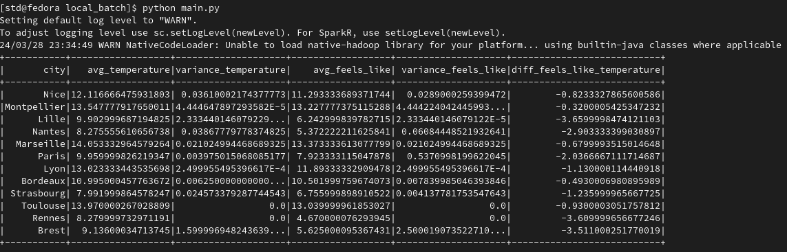

# 📚 About the Project

This is a project for the Advanced Big Data architecture course at [IMT Atlantique](https://www.imt-atlantique.fr/en).

# ☁️ Introduction

This project aims to conduct real-time analysis and monitoring of the biggest cities in France, with the purpose of deepening our understanding of the technologies required for implementing a lambda architecture.

Focusing on the speed layer of the architecture, this project aims to understand how to handle real-time consumed data, utilizing the technologies proposed in the classroom.

In the next sections will be provided the step by step of how to build and run the project, by creating the containers, the table in cassandra, executing the spark processing and then visualizing the data in Cassandra.

At the end the result achieved will be similar to the following demo video showing the final execution (starting the producer, than the spark processing, and visualizing the result in the Cassandra table):

(Demo Video)[https://www.youtube.com/embed/kukhTzwEq2E]

# ⚙️ Technologies

- [Python](https://www.python.org/)
- [Kafka](https://kafka.apache.org/)
- [Spark](https://spark.apache.org/)
- [Cassandra](https://cassandra.apache.org/_/index.html)
- [Docker](https://www.docker.com/)

# 🔗 API - OpenWeatherMap

API Description: Access current weather data for any location on Earth! We collect and process weather data from different sources such as global and local weather models, satellites, radars and a vast network of weather stations. Data is available in JSON, XML, or HTML format.

[OpenWeatherMap API - Current Data](https://openweathermap.org/current#data)

# 🛠️ Instructions

## 0. Add the API key to the project

Once you have cloned the repository you will need to create an account on the site below to get your api key, you will need to go to the apis section and generate a personal key to use.

[OpenWheaterMap](https://openweathermap.org/)

After doing this step, you must add a file named `.env` exactly inside the app folder of the producer. Check the path:

```
> producer > app > .env
```

Now you must add the following code inside the `.env` file with the API Key that was generated by the OpenWeatherMap

```py
export API_KEY = "0123api_key_example6789"
```

## 1. Build and run the containers of the structure with the apache, kafka, spark and cassandra:

In a terminal opened in the root directory of the project run the following commands:

```sh
cd kappa
docker-compose up -d
```

## 2. Build and run container that will send information to kafka (producer):

To start sending the information to kafka to be processed we need to create the producer container to that will generate the events.

```bash
# Considering that you are currently in the folder kappa/ from the previous command
cd ../producer
docker-compose up -d
```

## 3. Perform Docker buildx prune to clean up unused build cache.

```bash
docker buildx prune -f
```

## 4. Starting sending information to kafka

Open a bash session in the producer container and start the script `get-weather-data.py`:

```bash
docker exec -ti producer bash
```
```bash
cd app/; python get-weather-data.py
```

## 5. Start spark streaming

### 5.1 Check IP of Cassandra Cluster

To start this step we must first check the IP of the cassandra container to see if we need to change it in our producer script, for this look at the IP in that appears running the following command:

```bash
# Run in a terminal of the host machine
docker network inspect mynetwork
```

If needed change the IP's in the line 2 of `kappa/apps/create_structure_cassandra.py`:

```python
from cassandra.cluster import Cluster
clstr=Cluster(['172.19.0.2', '172.19.0.2']) # Change this line if needed
session=clstr.connect()
```

### 5.2 Create table in Cassandra

After that we checked if the IP's are correct we just need to run the script `create_structure_cassandra.py` in a bash session in the spark-master container:

```bash
docker exec -ti spark-master bash
```
```
cd ../spark-apps
python3 create_structure_cassandra.py
```

### 5.3 Start spark streaming

Now still inside the bash in the spark-master container just run the followinig command to start the processing:

```bash
# Enter bash session in spark-master container
docker exec -ti spark-master bash
```
```bash
spark-submit \
--packages org.apache.spark:spark-sql-kafka-0-10_2.12:3.5.1,com.datastax.spark:spark-cassandra-connector_2.12:3.5.0 \
--conf spark.cassandra.connection.host=cassandra1 \
--conf spark.cassandra.connection.port=9042 \
data-pipeline-streaming_cassandra.py kafka-weather-events
```

This will execute the spark workflow in the file `` data-pipeline`streaming_cassandra.py `` which receives the data calculates the difference between the temperature and the feels like temperature and stores this data in Cassandra.

## 6. Visualize table in Cassandra

After following the previous steps, the data generated by the `get-weather-data.py` along with the calculation of difference in real and feel-like temperature made by the spark processing will be stored in Cassandra.

For visualizing the data in the table we need to open a bash session in on of the cassandra containers, and start a interactive session to run CQL commands, and then we query the table to check the data:

```bash
docker exec -ti cassandra1 bash
```
```
cqlsh
```

After this command you will be in an interactive shell session in Cassandra, now just query the table to see the data:

```sql
select * from weather_keyspace.weather_table;
```

# Batch Processing

The primary goal of the project was to implement a full lambda architecture, but since the whole architecture is being implemented with docker containers on a single machine, after the implementation of the architecture with the speed layer we started to have problems with RAM that were not allowing a proper functioning of the containers. To solve that we tried to increase the maximum amount of resources available to the containers, but since the machines used in the tests of the container had only 16GB of RAM, additional containers were causing overflow of the RAM in the machine, so we could not implement in the available hardware the full architecture.

To be able to test a batch processing using Spark a simple local processing was made to test a pyspark code that could be used in the complete architecture. The principle is simple:

**1.** Get real time data from API (**local_batch/get-weather-data.py**)

**2.** Saves data in a local json file (**local_batch/get-weather-data.py**)

**3.** Script running pyspark to calculate informations like mean and variance of the data (**local_batch/batch_process.py**).


The result is shown in this print of the result on the terminal:



So although it's not an actual implementation of a batch layer in the architecture it could be used in a real one with the proper modification to fit in the architecture, and it has the main go of using the pyspark functions to do batch-like calculations.

# 👋 Authors

This project was made by [Breno Hasparyk](https://github.com/BrenoHA) and [Carlos Arguilar](https://github.com/CarlosArguilar)
